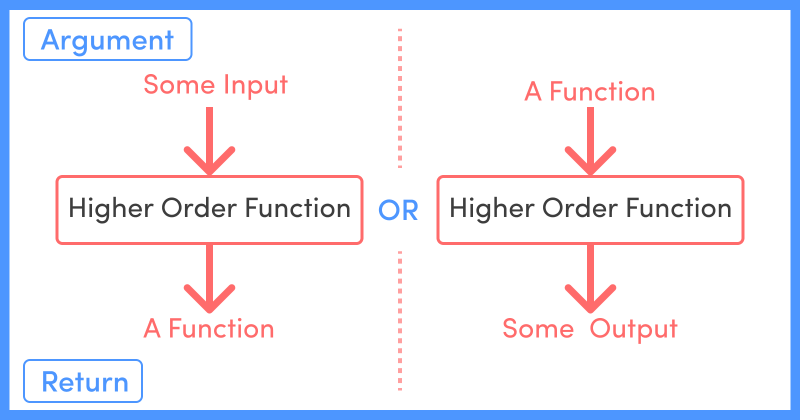

# Functions & Lambdas

## Functions

```python
def name_of_function (parameter1, parameter2):
    # block of code
    return value
```

### Default parameters

```python
def exponent(num, power=3):
    return num ** power

print(exponent(2, 2))  # 4
print(exponent(2))  # 8
```

### Keyword arguments

```python
def exponent(num, power):
    return num ** power

print(exponent(2, 3))  # 8
print(exponent(power=3, num=2))  # 8

power = 3
num = 2
print(exponent(power, num))  # 9
print(exponent(power=power, num=num))  # 8
```

### Special parameters

#### \*args

`*args` is a special operator we can pass to functions. Gathers remaining arguments as a **tuple**.

```python
def sum_nums(num1, num2, num3):
    return num1 + num2 + num3

print(sum_nums(1, 2, 3)) # 6

def sum_all_nums(*nums):
    total = 0
    for num in nums:
        total += num
    return total

print(sum_all_nums(1, 2, 3)) # 6
print(sum_all_nums(1, 2, 3, 4)) # 10
```

#### \*\*kwargs

`**kwargs` is a special operator we can pass to functions. Gathers remaining keyword arguments as a **dictionary**

```python
def fav_colors(**colors):
    for name, color in colors.items():
        print(f"{name}'s favorite color is: {color}")


fav_colors(raphael="purple", gabi="red", vitor="teal")
# raphael's favorite color is: purple
# gabi's favorite color is: red
# vitor's favorite color is: teal
```

### Parameter Ordering

1. parameters
2. \*args
3. default parameters
4. \*\*kwargs

```python
def example(a, b, *args, instructor="Raphael", **kwargs):
    return [a, b, args, instructor, kwargs]
```

### Unpacking

#### Unpacking tuples

```python
def sum_all_values(*args):
    print(args)
    total = 0
    for num in args:
        total += num
    return total

print(sum_all_values(1, 2, 3, 4, 5))  # 15

nums_list = [1, 2, 3, 4, 5]
print(sum_all_values(nums_list))
# # TypeError: unsupported operand type(s) for +=: 'int' and 'list'
# # *args are resulting in ([1, 2, 3, 4, 5],)

nums_tuple = (1, 2, 3, 4, 5)
print(sum_all_values(nums_tuple))
# # TypeError: unsupported operand type(s) for +=: 'int' and 'tuple'
# # *args are resulting in ((1, 2, 3, 4, 5),)

nums_list = [1, 2, 3, 4, 5]
print(sum_all_values(*nums_list))  # 15

nums_tuple = [1, 2, 3, 4, 5]
print(sum_all_values(*nums_tuple))  # 15
```

#### Unpacking dictionaries

```python
def display_names(first, second):
    return f"{first} says hello to {second}"

names = {"first": "Colt", "second": "Rusty"}

print(display_names(names)) # TypeError: display_names() missing 1 required positional argument: 'second'
print(display_names(**names)) # Colt says hello to Rusty
```

### Scopes

Variables created in functions are scoped in that function

```python
instructor = 'Colt'

def say_hello():
    return f"Hello {instructor}"

print(instructor)  # "Colt"
print(say_hello()) # "Hello Colt"
```

```python
def say_hello():
    instructor = 'Colt'
    return f"Hello {instructor}"

print(say_hello())
print(instructor) # NameError: name 'instructor' is not defined
```

Global variables inside functions: they are accessible but not manipulable. if a function tries to manipulate a variable that is not defined inside it, it will throw unless this variable is declared using the keyword `global`

```python
total = 0

def increment():
    total += 1 # UnboundLocalError: cannot access local variable 'total' where it is not associated with a value
    return total

increment()
```

```python
total = 0

def increment():
    global total
    total += 1
    return total

increment()
print(total) # 1
```

Parent's variables inside nested functions: they are accessible but could only be manipulated if declared with `nonlocal` keyword

```python
def outer():
    count = 0

    def inner():
        nonlocal count
        count += 1
        return count

    return inner()
```

### Documenting functions

```python
def say_hello():
    """A simple function that returns the string hello"""
    return "Hello!"

print(say_hello.__doc__)  # "A simple function that returns the string hello"
```

## Lambdas

```python
def square(num):
    return num * num

square2 = lambda num: num * num

print(square(2)) # 4
print(square2(2)) # 4
```

## Built-in functions

```python
"""
map: The map() function executes a specified function for each item in an iterable. The item is sent to the function as a parameter.
"""
nums = [2, 4, 6, 8, 10]
doubles = map(lambda x: x * 2, nums)

print(doubles)  # <map object at 0xffff9330da50>
print(list(doubles))  # [4, 8, 12, 16, 20]
print(list(doubles))  # [] - map object only iterates one time

"""
filter: The filter() function returns an iterator where the items are filtered through a function to test if the item is accepted or not.
"""
ages = [5, 12, 17, 18, 24, 32]
adults = filter(lambda x: x >= 18, ages)

print(list(adults))  # [18, 24, 32]

"""
combining filter & list
"""
names = ["Lassie", "Colt", "Rusty"]
print(list(map(lambda n: f"Your instructor is {n}", filter(lambda v: len(v) > 5, names)))) # ['Your instructor is Lassie']

"""
all: The all() function returns True if all items in an iterable are true, otherwise it returns False. If the iterable object is empty, the all() function also returns True.
"""
my_list = [True, True, True]
print(all(my_list))  # True

my_empty_list = []
print(all(my_empty_list))  # True

my_tuple = (0, True, False)
print(all(my_tuple))  # False

my_set = {0, 1, 0}
print(all(my_set))  # False

my_dict = {1: "Apple", 1: "Orange"}
print(all(my_dict))  # True

"""
any: The any() function returns True if any item in an iterable are true, otherwise it returns False. If the iterable object is empty, the any() function will return False.
"""
my_list = [True, True, True]
print(any(my_list))  # True

my_empty_list = []
print(any(my_empty_list))  # False

my_tuple = (0, True, False)
print(any(my_tuple))  # True

my_set = {0, 1, 0}
print(any(my_set))  # True

my_dict = {1: "Apple", 1: "Orange"}
print(any(my_dict))  # True

"""
sorted: The sorted() function returns a sorted list of the specified iterable object. You can specify ascending or descending order. Strings are sorted alphabetically, and numbers are sorted numerically.
"""
nums = (1, 11, 2)
print(sorted(nums))  # [1, 2, 11]

letters = ("h", "b", "a", "c", "f", "d", "e", "g")
print(sorted(letters, reverse=True)) # ['a', 'h', 'g', 'f', 'e', 'd', 'c', 'b']

users = [
    {"name": "Charlie", "age": 35, "city": "Chicago"},
    {"name": "Bob", "age": 25, "city": "Los Angeles"},
    {"name": "Alice", "age": 30, "city": "New York"},
    {"name": "David", "age": 28, "city": "San Francisco"}
]

print(sorted(users, key=lambda x: x['name']))
# [
#   {'name': 'Alice', 'age': 30, 'city': 'New York'},
#   {'name': 'Bob', 'age': 25, 'city': 'Los Angeles'},
#   {'name': 'Charlie', 'age': 35, 'city': 'Chicago'},
#   {'name': 'David', 'age': 28, 'city': 'San Francisco'}
# ]

"""
max: The max() function returns the item with the highest value, or the item with the highest value in an iterable. If the values are strings, an alphabetically comparison is done.
"""
max(n1, n2, n3, ...) # or
max(iterable)

"""
min: The min() function returns the item with the lowest value, or the item with the lowest value in an iterable. If the values are strings, an alphabetically comparison is done.
"""
min(n1, n2, n3, ...) # or
min(iterable)

"""
reversed: The reversed() function returns a reversed iterator object.
"""
alph = ["a", "b", "c", "d"]
print(list(reversed(alph))) # ['d', 'c', 'b', 'a']

"""
abs: The abs() function returns the absolute value of the specified number.
sum: The sum() function returns a number, the sum of all items in an iterable.
round: The round() function returns a floating point number that is a rounded version of the specified number, with the specified number of decimals. The default number of decimals is 0, meaning that the function will return the nearest integer.
"""

"""
zip: The zip() function returns a zip object, which is an iterator of tuples where the first item in each passed iterator is paired together, and then the second item in each passed iterator are paired together etc. If the passed iterables have different lengths, the iterable with the least items decides the length of the new iterator.
"""
nums1 = [1, 2, 3]
nums2 = [4, 5, 6]

zipped = zip(nums1, nums2)
print(zipped)  # <zip object at 0xffffb4810ec0>

zipped = zip(nums1, nums2)
print(list(zipped))  # [(1, 4), (2, 5), (3, 6)]

zipped = zip(nums1, nums2)
print(dict(zipped))  # {1: 4, 2: 5, 3: 6}

```

## Generators

### Iterators vs iterables

- Iterator: an object that can be iterated upon. An object which returns data, one element at a time when `next()` is called on it.
- Iterable: an object which will return an iterator when `iter()` is called on it.

`"hello"` is an iterable, but it is not an iterator
`iter("hello")` returns an iterator

Example:

```python
name = "Oprah"

next(name) # TypeError: 'str' object is not an iterator

it = iter(name)
print(it)  # <str_ascii_iterator object at 0xffffb697cdc0>

print(next(it)) # O
print(next(it)) # p
print(next(it)) # r
print(next(it)) # a
print(next(it)) # h
print(next(it)) # StopIteration
```

### Functions vs Generators

| functions                              | generators                        |
| -------------------------------------- | --------------------------------- |
| uses `return`                          | uses `yield`                      |
| return once                            | can yeald multiple times          |
| when invoked, returns the return value | when invoked, returns a generator |

```python
def count_up_to(max):
    count = 1
    while count <= max:
        yield count
        count += 1

counter = count_up_to(10)

for n in counter:
    print(n)
```

### Generator expressions

- You can create generator from generator expressions
- Generator expressions look a lot like list comprehensions
- Generator expressions use () instead of []

```python
def nums():
  for num in range(1, 10):
    yield num

g= nums()
g = (num for num in range(1, 10))
```

## Decorators

Decorators are HOF - High Order Functions



```python
def be_polite(func):
    def wrapper():
        print("What a pleasure to meet you!")
        func()
        print("Have a great day!")
    return wrapper


def greet():
    print("My name is Raphael.")

greet = be_polite(greet)
greet()
# What a pleasure to meet you!
# My name is Raphael.
# Have a great day!

"""
using decorator
"""
@be_polite
def greet():
    print("My name is Raphael.")

greet()
# What a pleasure to meet you!
# My name is Raphael.
# Have a great day!

"""
with different signatures and multiple arguments
"""
def shout(func):
    def wrapper(*args, **kwargs):
        return func(*args, **kwargs).upper()
    return wrapper

@shout
def greet(name):
    return f"Hi, I'm {name}"

@shout
def order(main, side):
    return f"Hi, I'd like the {main}, with a side of {side}, please"

print(greet("Raphael"))  # HI, I'M RAPHAEL
print(order("parmegiana", "fries")) # HI, I'D LIKE THE PARMEGIANA, WITH A SIDE OF FRIES, PLEASE
```

### Preserving metadata

```python
"""
without preserving metadata
"""
def a_decorator(func):
    def wrapper(*args, **kwargs):
        """A wrapper function"""
        # Extend some capabilities of func
        func()
    return wrapper

@a_decorator
def first_function():
    """This is docstring for first function"""
    print("first function")

@a_decorator
def second_function(a):
    """This is docstring for second function"""
    print("second function")

print(first_function.__name__)  # wrapper
print(first_function.__doc__)  # A wrapper function
print(second_function.__name__)  # wrapper
print(second_function.__doc__)  # A wrapper function

"""
preserving metadata
"""
from functools import wraps

def a_decorator(func):
    @wraps(func)
    def wrapper(*args, **kwargs):
        """A wrapper function"""

        # Extend some capabilities of func
        func()
    return wrapper

@a_decorator
def first_function():
    """This is docstring for first function"""
    print("first function")

@a_decorator
def second_function(a):
    """This is docstring for second function"""
    print("second function")

print(first_function.__name__)  # first_function
print(first_function.__doc__)  # This is docstring for first function
print(second_function.__name__)  # second_function
print(second_function.__doc__)  # This is docstring for second function
```

### Passing values to a decorator

```python
from functools import wraps

def ensure_first_args_is(val):
    def inner(func):
        @wraps(func)
        def wrapper(*args, **kwargs):
            if args and args[0] != val:
                raise ValueError(f"First arg needs to be {val}")
            return func(*args, **kwargs)
        return wrapper
    return inner

@ensure_first_args_is("burrito")
def fav_food(*foods):
    print(foods)

fav_food("burrito", "parmegiana") # ('burrito', 'parmegiana')
fav_food("parmegiana", "burrito") # ValueError: First arg needs to be burrito

@ensure_first_args_is(10)
def adds(num1, num2):
    return num1 + num2

print(adds(10, 20)) # 30
print(adds(20, 10)) # ValueError: First arg needs to be 10
```

### Decorator examples

```python
"""
speed tester decorator
"""
from time import time
from functools import wraps

def speed_test(func):
    @wraps(func)
    def wrapper(*args, **kwargs):
        start_time = time()
        result = func(*args, **kwargs)
        total_time = time() - start_time
        print(f"{func.__name__} took {total_time} to run")
        return result
    return wrapper

@speed_test
def sum_nums():
    return sum(x for x in range(1000000))

sum_nums()

"""
ensuring no kwargs
"""
from functools import wraps

def ensure_no_kwargs(func):
    @wraps(func)
    def wrapper(*args, **kwargs):
        if kwargs:
            raise ValueError("No kwargs allowed")
        return func(*args, **kwargs)
    return wrapper

@ensure_no_kwargs
def greet(name):
    print(f"Hi there {name}")

greet("Raphael") # Hi there Raphael
greet(name="Raphael") # ValueError: No kwargs allowed

"""
enforcing argument types
"""
def enforce(*types):
    def decorator(f):
            def new_func(*args, **kwargs):
                newargs= []
                for (a, t) in zip(args, types):
                    newargs.append( t(a))
                return f(*newargs, **kwargs)
            return new_func
    return decorator

@enforce(str, int)
def repeat_msg (msg, times):
    for time in range(times):
        print (msg)

repeat_msg ("hello", 2)
# hello
# hello
repeat_msg ("hello", '2')
# hello
# hello
repeat_msg ("hello", [2,2]) # TypeError: int() argument must be a string, a bytes-like object or a real number, not 'list'
```
